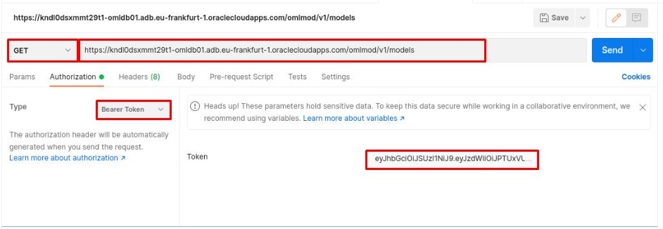
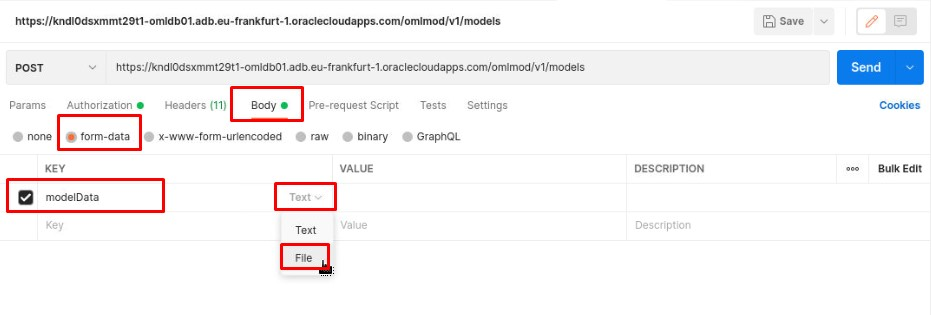
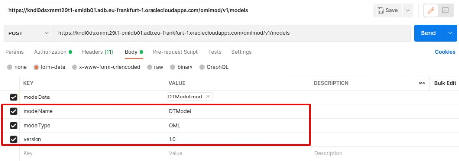
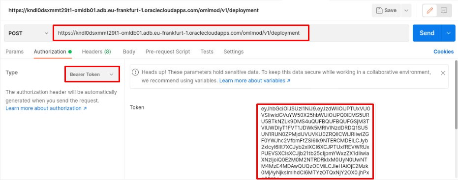

# Store an OML model and score it using OML Services

In this chapter, we will import and store the Decision Tree model in our OML Services repository and score it using REST APIs.

Estimated Time: 20 minutes

### Objectives
We are going to run the next steps:
* Extract the saved model to a file;
* Store the model in the OML Services repository;
* Deploy the model;
* Score a customer using the Decision Tree model;


### Prerequisites
* Autonomous Database created
* OML user created in Autonomous database
* ``DTModel.mod`` on the VM

##
## Task: 1: Store the model in the OML Services repository


*  In the Postman session open, run the following Get method to get the list of models deployed.

````
Operation: GET

URI endpoint:
<copy>https://<oml-cloud-service-location-url>.oraclecloudapps.com/omlmod/v1/models</copy>

````
 - Replace **`<oml-cloud-service-location-url>`** with your URL saved in the chapter "Scoring OML model using OML Services" Task 1.2: Authorize OML Services User

 In the Authorization tab, pick **Bearer Token** and paste the token copied from *Scoring OML using OML Services Task 1*.

 

The response is just the **SVMG** model we used in our previous tasks.

  

If you get the Expired Token Error, rerun the generate Token command explained in **Scoring OML using Rest Services: Task 1**.

* Open a new tab in Postman and run the following POST command to store the model in the OML Services repository.

````
Operation: POST

URI endpoint:
<copy>https://<oml-cloud-service-location-url>.oraclecloudapps.com/omlmod/v1/models</copy>

````
 - Replace **`<oml-cloud-service-location-url>`** with your URL saved.

 In the Authorization tab, pick **Bearer Token**, and the token is pre-filled.

 

In the Headers tab, enter the following:

````
Content-Type: multipart/form-data
boundary: Boundary
````

  


In the Body tab, pick form-data and enter **`modelData`** in the Key area, hover over the right side of the field, and select File in the dropdown.

  

Click Select File; go to `/home/oracle/OML-Services/` folder and select the **`DTModel.mod`** file created earlier.

  

Add the below keys in the Body tab and click Send.

````
 modelName=DTModel
 modelType=OML
 version=1.0
````
  

The response status is '201 Created'. We succeeded in saving the model in the repository.

 

Copy the **`modelId`** displayed in the JSON response.

## Task: 2: Deploy the model

* Open a new tab in Postman and run the following POST command to deploy the model in Autonomous Database.

````
Operation: POST

URI endpoint:
<copy>https://<oml-cloud-service-location-url>.oraclecloudapps.com/omlmod/v1/deployment</copy>

````
 - Replace **`<oml-cloud-service-location-url>`** with your URL saved.


In the Authorization tab pick **Bearer Token** and the token is pre-filled.

    

In the Headers tab enter the following:

````
Content-Type: application/json
````

  

 In the Body tab enter the following JSON:

````
 <copy>{
   "uri":"dtmodel",
   "modelId":"50ffc903-aaf6-4a94-a228-4cb7ab6b3c07"
}</copy>
````

Where `50ffc903-aaf6-4a94-a228-4cb7ab6b3c07` is the model Id copied from the previous step. Replace it with the returned model Id from your command in Task 6.2.

The URI **`dtmodel`** we are going to use in Task 6.4 when scoring the data against our model.

  

And the result is:

 

The next step is to score a customer.


## Task: 3: Score a customer using the Decision Tree model

In this step, we are going to score Fran Hobbs against our Decision Tree imported model.

Enter the following details:

````
Operation: POST

URI endpoint:
<copy>https://<oml-cloud-service-location-url>.oraclecloudapps.com/omlmod/v1/deployment/<model_URI>/score </copy>

````
- Replace **`<oml-cloud-service-location-url>`** with your URL saved.

 - Replace **`<model_URI>`** with the model URI that we defined in the previous task: **`dtmodel`**

In the Authorization tab pick **Bearer Token** and the token is pre-filled.

   


In the header Tab enter the details:

````
--header 'Content-Type: application/json'

````

    


In the Body tab, please enter the Fran Hobs data in RAW format. Notice that we are not providing any of the ``LTV`` or ``LTV_BIN`` data, but provide fully the other important data

````
<copy>
{
   "inputRecords":[
      {
         "CUST_ID":"CU12350",
         "LAST":"FRAN",
         "FIRST":"HOBBS",
         "STATE":"NV",
         "REGION":"Southwest",
         "SEX":"F",
         "PROFESSION":"Programmer/Developer",
         "BUY_INSURANCE":"No",
         "AGE":21,
         "HAS_CHILDREN":0,
         "SALARY":66180,
         "N_OF_DEPENDENTS":5,
         "CAR_OWNERSHIP":1,
         "HOUSE_OWNERSHIP":0,
         "TIME_AS_CUSTOMER":5,
         "MARITAL_STATUS":"SINGLE",
         "CREDIT_BALANCE":0,
         "BANK_FUNDS":500,
         "CHECKING_AMOUNT":185,
         "MONEY_MONTLY_OVERDRAWN":53.21,
         "T_AMOUNT_AUTOM_PAYMENTS":197,
         "MONTHLY_CHECKS_WRITTEN":4,
         "MORTGAGE_AMOUNT":0,
         "N_TRANS_ATM":3,
         "N_MORTGAGES":0,
         "N_TRANS_TELLER":2,
         "CREDIT_CARD_LIMITS":2500,
         "N_TRANS_KIOSK":4,
         "N_TRANS_WEB_BANK":0
      }
   ]
}
</copy>
````

Click Send

    

Notice the response for this scoring.

    

In this case, the percentages are different but it still has the highest probability to be in the **LOW** category as it was in our Support Vector Machine Gaussian model.


## Acknowledgements
* **Authors** -  Andrei Manoliu, Milton Wan
* **Contributors** - Rajeev Rumale
* **Last Updated By/Date** -  Andrei Manoliu, December 2021

## Need Help?
Please submit feedback or ask for help using our [LiveLabs Support Forum](https://community.oracle.com/tech/developers/categories/livelabsdiscussions). Please click the **Log In** button and login using your Oracle Account. Click the **Ask A Question** button to the left to start a *New Discussion* or *Ask a Question*.  Please include your workshop name and lab name.  You can also include screenshots and attach files.  Engage directly with the author of the workshop.

If you do not have an Oracle Account, click [here](https://profile.oracle.com/myprofile/account/create-account.jspx) to create one.
