# Load and Prepare Data

## Introduction

In this lab, we will start from a newly created Oracle Autonomous Database instance and prepare it for the workshop.

 You will collect the connection details and create the users and passwords. Using them, you will load the data into Autonomous Database and prepare to use it in Oracle Machine Learning Notebooks.

Estimated Lab Time: 15 minutes

### Objectives
*	Create the OMLUSER user
* Load data into ADB

### Prerequisites
* Oracle Cloud Infrastructure (OCI) account
* Autonomous Database deployed in Oracle Cloud

## Task 1:  Create the OMLUSER user

* Connect to the Oracle Cloud Infrastructure (OCI) Console and go to the Autonomous Database home page.
* Click on the target Autonomous Database instance

* In the Autonomous Database instance, click on the Tools tab and click on the **Open Oracle ML User Administration**
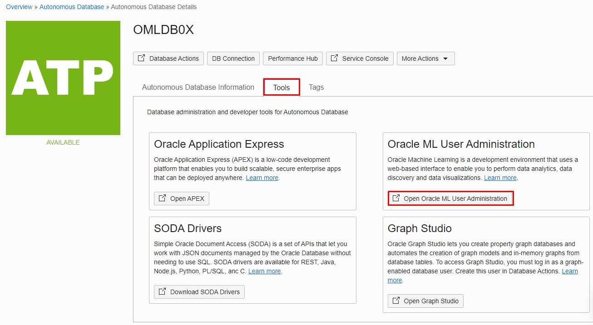

* In the Oracle Machine Learning Database Administrator credentials page, enter the username: **ADMIN** and password.
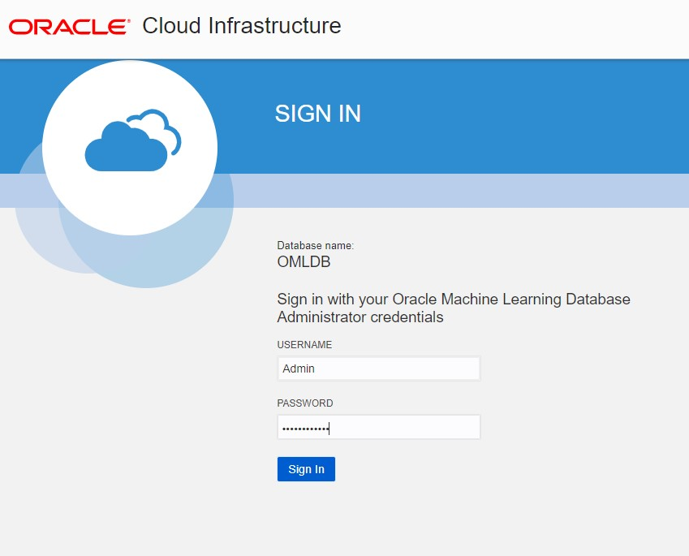

* In the Machine Learning User Administration, we see only the ADMIN user with the System Administrator role. Click on the Create button to create another user.

* In the Create User page, please enter the following:

- Username: **OMLUSER**;
- Email Address: **An email address**;
- **Un-check**: Generate password and email the account details to user;
- Password: Chose a password. Throughout the workshop we are using **Welcome12345** as a password for OMLUSER;
- Confirm Password: **Retype the password**;

Click Create.
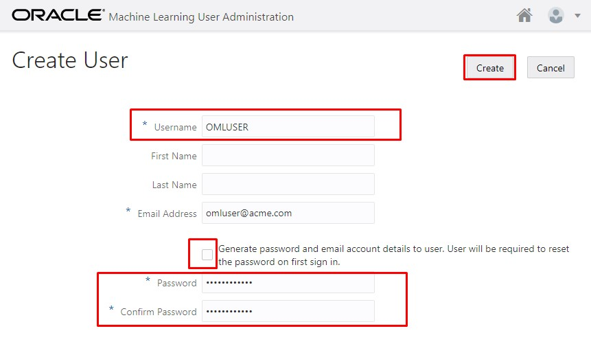

* Now, we have a new user named OMLUSER available.
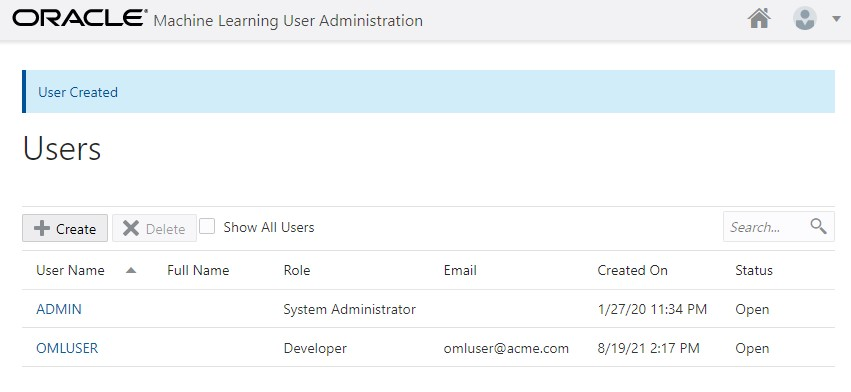

OMLUSER is also a database user, and for the moment, he doesn't have access to our data. The next step is to load our data in the OMLUSER schema.

## Task 2: Loading the data

* In the Autonomous Database instance detail page, click on the Database Actions button.
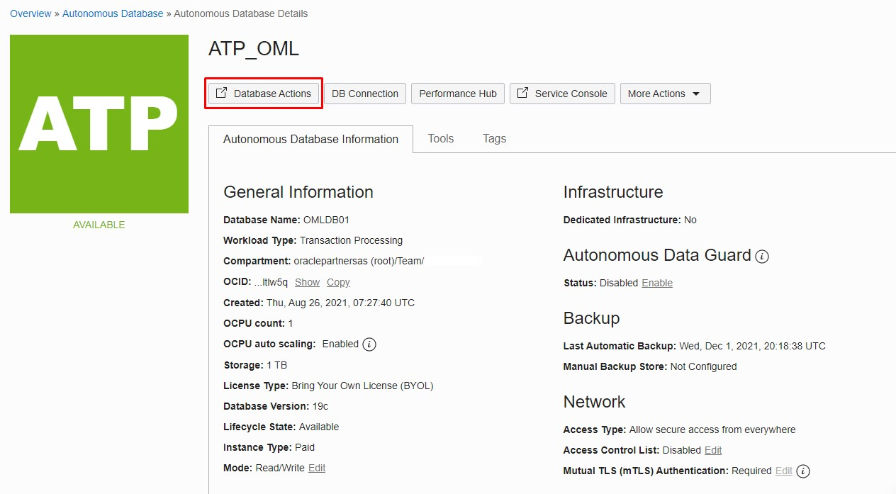

* The Database Actions launchpad page is now open and connected by default with the ADMIN user. Here we have multiple tools available to easily manage and use the database, develop new applications or REST modules, or manage data inside the database.

 We will choose SQL option in the Development category.
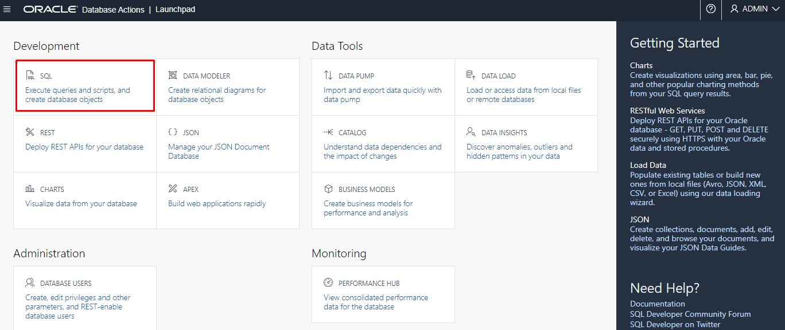

* Select the Data Loading tab in the middle part of the screen.
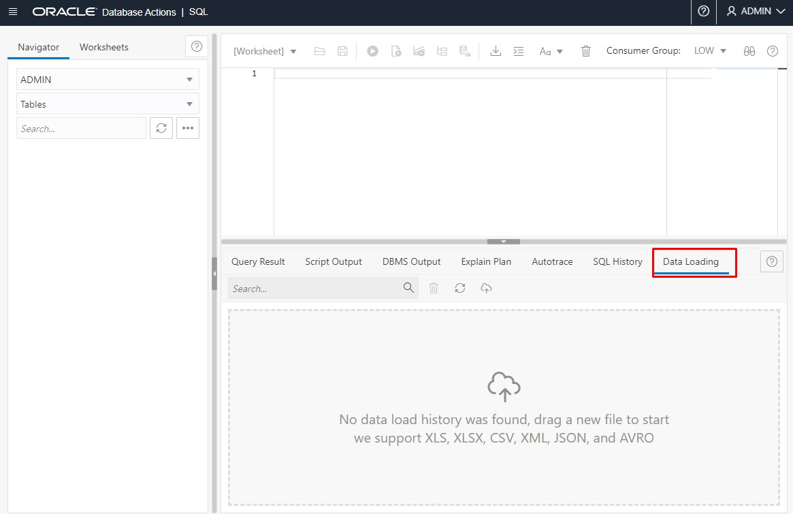

* Download the [cust\_insur\_ltv.csv](https://objectstorage.eu-frankfurt-1.oraclecloud.com/p/NIPrIgDVBKsOBi_xnF5_ZHWAnlilwwnUbrgQbUA24iupm6ryoNkvp_KZ9qywzpQE/n/oraclepartnersas/b/ADB_Stage/o/cust_insur_ltv.csv) and load it using Drag and drop on the delimited section.
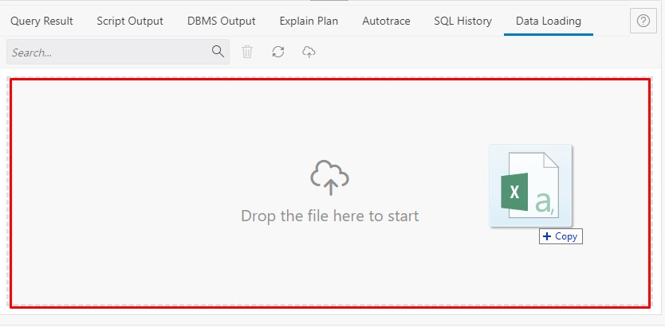

* The file is parsed and a preview is displayed on the screen. Check the priview and click Next.
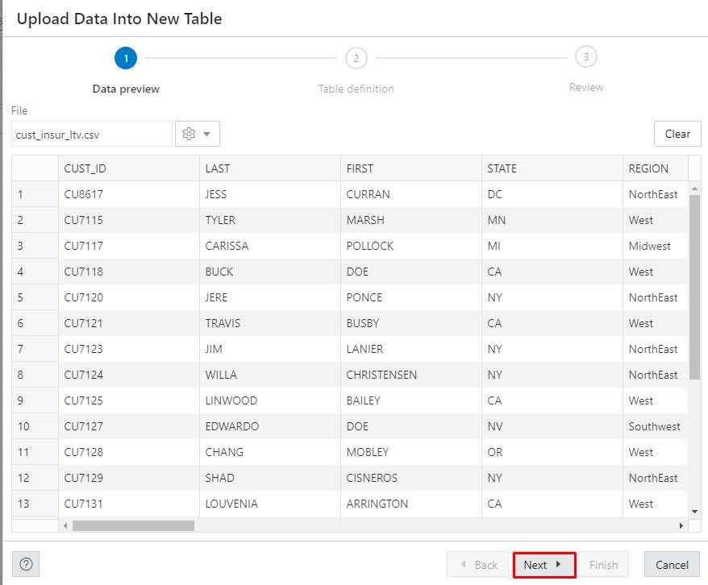

* The Table Definition screen.
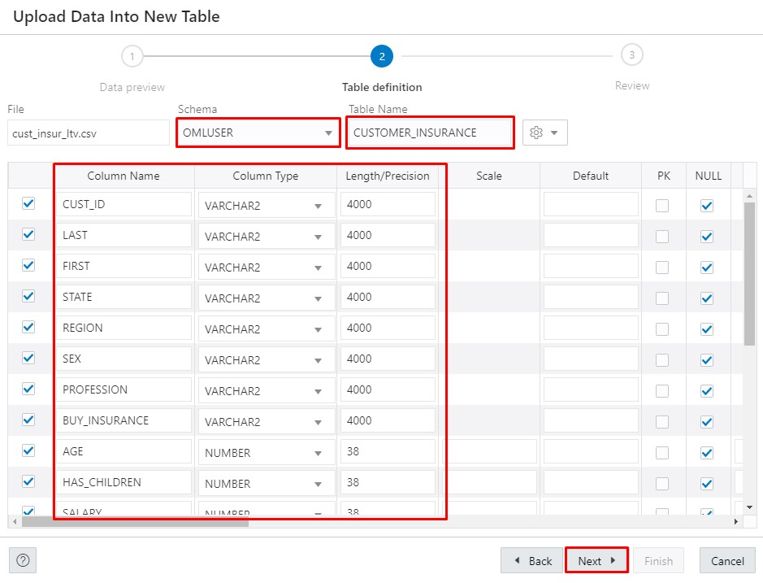

Here, you should update the following:
 - Change the target Schema to **OMLUSER**
 - Change the target Table Name to **CUSTOMER_INSURANCE**

You can keep the default table and mapping options.

Click Next.

* In the Review screen, click on Finish to start the data load.
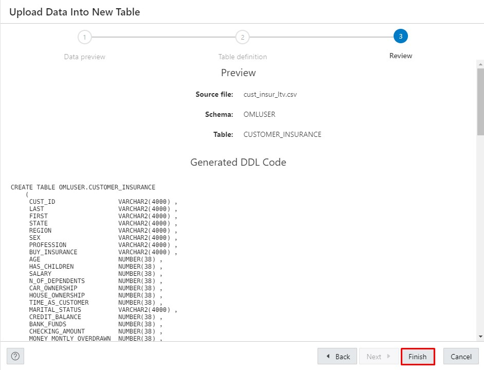

* The uploading data confirmation shows up.
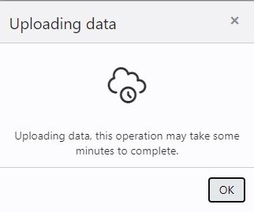

* The data loading process takes less than a minute. When completed, please notice the entry on the Data Loading tab.
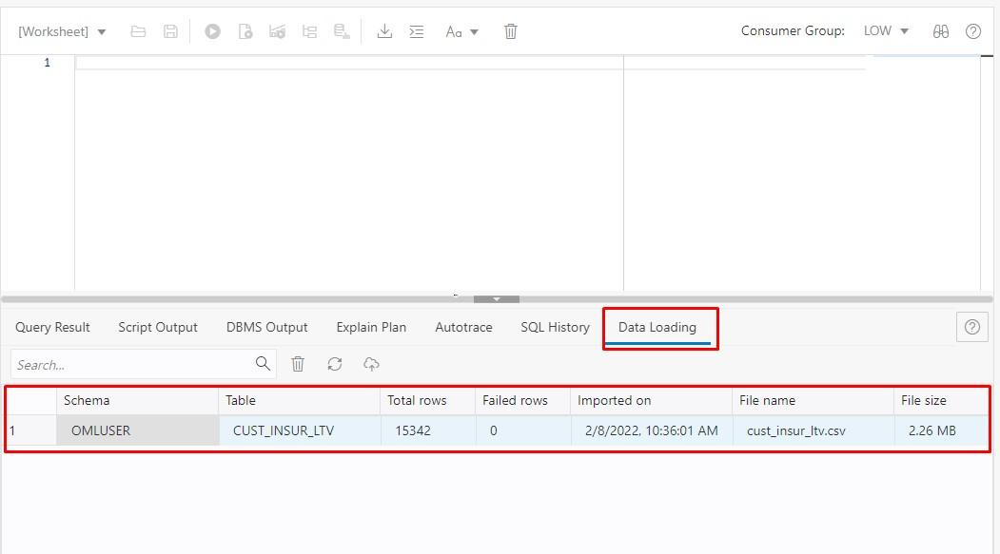

* When you click on the row, you will get a confirmation.
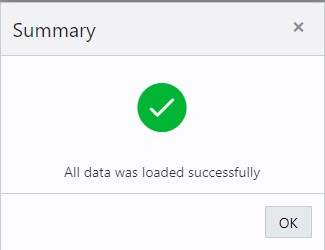

* Click OK.

The next step is to use this data and create an AutoML model.

## Acknowledgements
* **Authors** -  Andrei Manoliu, Milton Wan
* **Contiributors** - Rajeev Rumale, Mark Hornick, Sherry LaMonica
* **Last Updated By/Date** -  Andrei Manoliu, December 2021

## Need Help?
Please submit feedback or ask for help using our [LiveLabs Support Forum](https://community.oracle.com/tech/developers/categories/livelabsdiscussions). Please click the **Log In** button and login using your Oracle Account. Click the **Ask A Question** button to the left to start a *New Discussion* or *Ask a Question*.  Please include your workshop name and lab name.  You can also include screenshots and attach files.  Engage directly with the author of the workshop.

If you do not have an Oracle Account, click [here](https://profile.oracle.com/myprofile/account/create-account.jspx) to create one.
